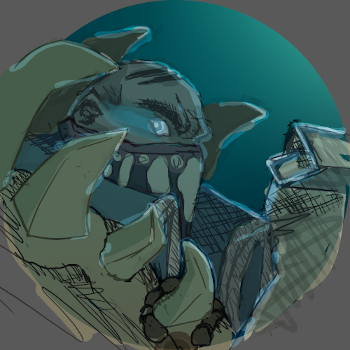

# PykeBot

PykeBot is a Discord bot that collects League of Legends summoner names for the participants of tournaments.
Given a link the bot will find all players in the tournament and build op.gg multilinks for them.
Furthermore, the bot can go on op.gg and add soloQ rankings to each team and player.

For now PykeBot supports SINN League, Toornament, Premiertour and Challengermode.

## Installation

PykeBot requires Python Version 3.7 or newer.
The required libraries can be installed via pip.
Simply run pip install -r requirements.txt in the project folder.

The geckodriver can be found here https://github.com/mozilla/geckodriver/releases
for windows user simply place the geckodriver.exe in the same folder as this project.
Firefox needs to be installed in order for this to work.

PykeBot also requires a valid Discord api token which needs to be placed in a file called TOKEN in the project folder.
A tutorial on how to create a Discord Bot and token can be found here:
https://github.com/reactiflux/discord-irc/wiki/Creating-a-discord-bot-&-getting-a-token

## Usage

Running main.py will start the Discord Bot which will await commands.
Available commands are:

.lolstalk url

.lolextstalk url

.lolsetregion region

"stalk" will return team names and multilinks for teams in the given tournament or match.
"extstalk" additionally collects the player soloQ rankings. This might take a moment longer to run.
"setregion" will update the region used in the multilinks and player lookups.

## Features

The following links can be stalked:

Toornament Tournaments

Challengermode Matches

Summoners INN League Seasons

Summoners INN League Groups

Summoners INN League Teams

PremierTour Leagues

## TODO

- finish challengermode tournament stalker
- add ESL stalking
- add Battlefy stalking
- Output as file option

## Credit
The PykeBot Icon was designed by the talented Binidi:
https://www.deviantart.com/binidi/art/Pyke-Icon-808245658